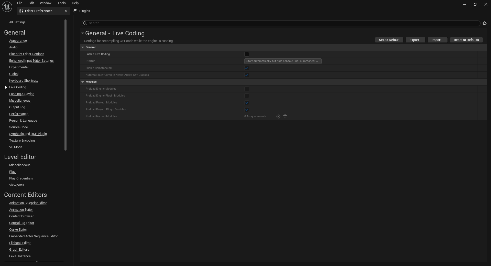

# Slate Setup
Live coding should be turned off when working with slate (and in general imo) as it can cause bugs, editor crashes, and can cause the ui elements to not be hot reloaded.  To do this follow `Edit > Editor Preferences > Live Coding` and make sure the "Enable Live Coding" button is turned off as such

Before you can work with Slate UI you must add the required dependancies,
```CSharp
	PrivateDependencyModuleNames.AddRange(new string[] {  
		"Slate",  
		"SlateCore"  
	});
```

Your build file may already include one or both of these, if this is the case only add the packages that are absent.

# Basic Widget Setup

## Creating your first slate class


## Full Code
**SHUDWidget.h**
```CPP
	#include "CoreMinimal.h"  
	#include "Widgets/SCompoundWidget.h"
	
	class MYPROJECT_API SHUDWidget : public SCompoundWidget  
	{  
	public:  
		SLATE_BEGIN_ARGS(SHUDWidget){}  
		  
			/** HUD class that owns the menu */  
			SLATE_ARGUMENT(TWeakObjectPtr<class AMainHUD>, OwningHud)  
			
		SLATE_END_ARGS()  
	  
		/** Constructs this widget with InArgs */  
		void Construct(const FArguments& InArgs);  
		
	protected:	   
		/** Allows for the keyboard focus to be assigned to the widget */  
		virtual bool SupportsKeyboardFocus() const override { return true; };
	};
```

**SHUDWidget.cpp**
```CPP
	BEGIN_SLATE_FUNCTION_BUILD_OPTIMIZATION  
	void SHUDWidget::Construct(const FArguments& InArgs)  
	{
		bCanSupportFocus = true;
		OwningHud = InArgs._OwningHud;

		ChildSlot  
		.HAlign(HAlign_Fill)  
		.VAlign(VAlign_Fill)  
		[
			SNew(SConstraintCanvas)  
			// Top Left Screen Alignment    
			+ SConstraintCanvas::Slot()  
			.AutoSize(true)  
			.Anchors(FAnchors(0, 0))  
			.Alignment(FVector2D(0,0))  
			[
				SNew(STextBlock)  
				.Text(FText::FromString("Hello World"))  
				.Justification(ETextJustify::Center)
				.Font(FSlateFontInfo("Verdana", 16))  
				.ColorAndOpacity(FColor::Red)
			]
		]
	}
	END_SLATE_FUNCTION_BUILD_OPTIMIZATION
```

 
# HUD Setup
## Creating the HUD Class
To Use slate within your game a HUD class is first required. HUD classes 

## Full Code
**AMainHUD.h**
```CPP	  
	UCLASS()  
	class MYPROJECT_API AMainHUD : public AHUD  
	{  
		GENERATED_BODY()  
	public:	  
		AMainHUD();
		
	protected:  
		virtual void BeginPlay() override;

	public:
		void DisplayMainHud();

	protected:  
		TSharedPtr<class SHUDWidget> HUDWidget;  
		TSharedPtr<class SWidget> HUDWidgetContainer;
	};
```

**AMainHUD.cpp**
```CPP
	AMainHUD::AMainHUD() {}

	void AMainHUD::BeginPlay()  
	{  
		DisplayMainHud() 
	}

	void AMainHUD::DisplayMainHud() 
	{
		if (GEngine && GEngine->GameViewport)  
		{
			HUDWidget = SNew(SHUDWidget).OwningHud(this).debug(bDebug);  
			  
			GEngine->GameViewport->AddViewportWidgetContent(SAssignNew(HUDWidgetContainer, SWeakWidget).PossiblyNullContent(HUDWidget.ToSharedRef()));  
			  
			if (PlayerOwner)  
				PlayerOwner->SetInputMode(FInputModeGameAndUI());
		}
	}
```